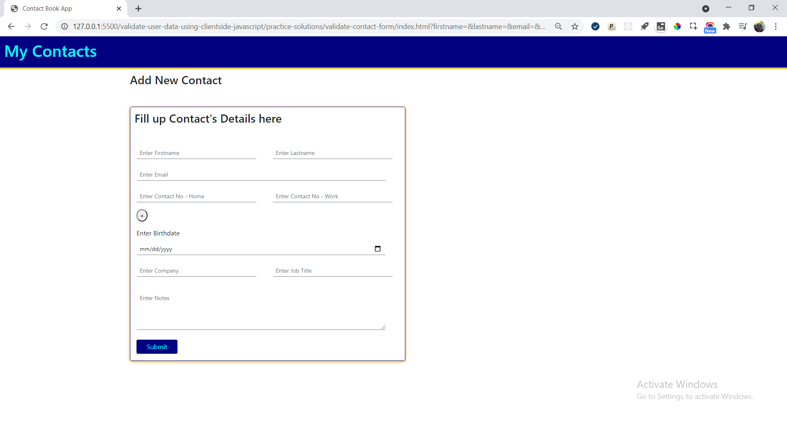

## Practice Challenge

### Validate Inputs Captured from Add New Contact Form

#### Context

Prime Solutions is an IT solutions provider company who have earned reputation in providing IT solutions in different business domains

Recently they have received a project to develop contact book app.

Prime Solutions have approached Graffitti designers for a good UI design.

The design is ready and now it needs to be made functional.

The development will be carried out in stages.

In the first stage of development, you as a frontend developer have to develop solution to capture and validate inputs

##### Contact Form

Graffitti Designers have designed contact form that allows app users to provide inputs

Below is the image of UI of contact form.

#### Challenge

The contact form currently has fields that captures basic contact details.

However, more fields can be added going forward

For a lengthy form, upon validations, displaying error messages with the fields would make it difficult to the user to locate fields with invalid values

Hence, it is suggested to have error messages displayed as validation summary block above the form

Also, the fields with invalid values, should be marked with a `*`

The form design also has option to add contact no fields dynamically to capture more contact nos.

The code developed should ensure validations is taken care for these fields added dynamically

#### Problem Statement

Capture and validate inputs submitted by user through add contact form.

If inputs are invalid meaningful error messages should be displayed.

If inputs are valid, the contact details should be stored in contacts collection.

##### Validation Criteria

1. Mandatory Inputs
    - Firstname
    - Email
    - Home Contact No

2. Firstname and Lastname should allow only alphabets and (.)

3. 2 Additional input fields should be created for capturing contact numbers

4. Contact Nos inputted should be in one of the following formats:
    - +910999999999
    - +91099-999-9999
    - +91(099)-999-9999
    - +91(099)9999999
    - +91099 999 9999
    - +91099 999-9999
    - +91(099) 999-9999
    - +91099.999.9999
    - +91 0999999999
    - +91 099-999-9999
    - +91 (099)-999-9999
    - +91 (099)9999999
    - +91 099 999 9999
    - +91 099 999-9999
    - +91 (099) 999-9999
    - +91 099.999.9999

5. Email should be of the format: `example@domain.com`

6. Birthdates for which age is less than 15 years should be disabled

7. Notes should not allow more than 200 characters to be inputted

#### Instructions

1. Fork the boilerplate
2. Clone the forked repository
3. Provide the solution code inside the script file `script.js`.
4. Ensure no other codes get modified, else, the rendering logic will fail to generate desired output.
5. Launch the `index.html` page on the browser to view the rendered output
